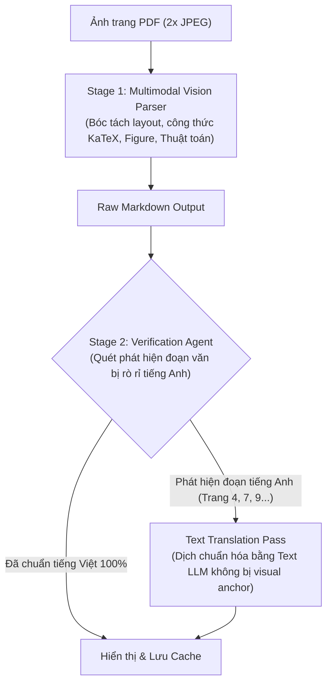
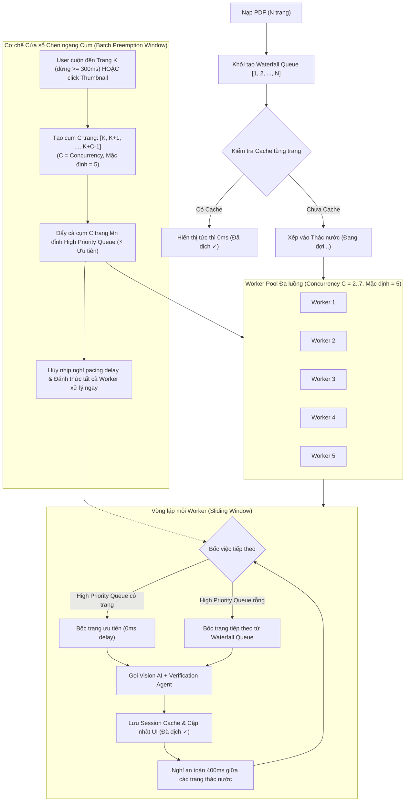

# NHẬT KÝ THEO DÕI VÀ QUẢN LÝ LỖI DỰ ÁN (LIVE-TRANS ISSUE LOG)

Tài liệu này tổng hợp toàn bộ các lỗi phát sinh trong quá trình phát triển, kiểm thử và vận hành dự án Live-Trans, phân tích nguyên nhân gốc rễ (root causes), giải pháp đã áp dụng và trạng thái khắc phục.

---

## 1. Danh sách lỗi đã ghi nhận & Xử lý

| Mã lỗi | Hạng mục | Mô tả hiện tượng | Nguyên nhân gốc rễ | Giải pháp áp dụng | Trạng thái |
| :--- | :--- | :--- | :--- | :--- | :--- |
| **ISSUE-001** | UI / Viewer | Khi cuộn hết nội dung trong trang (pane trái/phải), thanh cuộn bị khựng lại, không cuộn tiếp sang trang kế tiếp. | Sự kiện cuộn wheel hoặc overflow container bị chặn/ngắt kết nối sự kiện cuộn xuyên trang (scroll chaining). | Cho phép scroll chaining tự nhiên giữa các trang trên viewer container. | ✅ Đã khắc phục |
| **ISSUE-002** | VLM / Renderer | Khung thuật toán (Algorithm 1) hiển thị vỡ vụn: lộ các ký tự raw LaTeX `\quad`, `\qquad`, thụt dòng lỗi, khoảng cách dòng quá thưa, mất khung hộp học thuật. | Markdown VLM trả về chứa các lệnh TeX thô ngoài math mode và chưa có component hiển thị chuyên biệt cho Algorithm. | Tạo component `VisionAlgorithmCard` với 2 đường viền học thuật, thẻ badge THUẬT TOÁN; bộ tiền xử lý `parseAlgorithmLine` tự động strip `\quad`, tính mức thụt lề 4 space, in đậm từ khóa `for`, `do`, `if`. | ✅ Đã khắc phục |
| **ISSUE-003** | VLM / Prompt | Lỗi thứ tự đọc trên văn bản 2 cột (ví dụ Trang 9): Mục 4 cuối cột 1 (*Segmentation-Guided Inpainting*) bị đẩy xuống dưới cùng sau cả Mục 7 và References do model đọc Cột 2 trước. | VLM đọc lướt thấy tiêu đề to ở Cột 2 (*5. Limitations*) hoặc ưu tiên Figure ở Cột 1 rồi nhảy sang cột khác. | Thêm quy tắc phân biệt rõ layout 1 cột vs 2 cột trong `buildVisionPrompt`. Với 2 cột, bắt buộc đọc hết Cột 1 từ trên xuống dưới trước khi sang Cột 2; ghép nối từ gạch nối cuối dòng. | ✅ Đã cấu hình prompt |
| **ISSUE-004** | VLM / Translation | Hiện tượng Trôi ngôn ngữ (Language Drift) trên Trang 4: Bản dịch đang là tiếng Việt thì sau Phương trình (7) bất ngờ quay ngoắt sang 100% tiếng Anh. | Token công thức toán học kích hoạt bộ nhớ pre-training bài báo gốc (arXiv) của LLM. Do mô hình Vision bị visual anchor từ ảnh gốc tiếng Anh, context token sau công thức bị khóa cứng vào tiếng Anh. | Tích hợp **Verification Agent** (`verifyAndRepairTranslation`): Tự động phát hiện các đoạn văn tiếng Anh sau công thức và dịch làm sạch bằng Text LLM (không có visual anchor). | ✅ Đã khắc phục & Kiểm chứng |
| **ISSUE-005** | VLM / Translation | Hiện tượng không dịch được gì trên Trang 7 và Trang 9 (trả về 100% tiếng Anh nguyên văn như OCR). | VLM khi bắt đầu bằng dòng caption Figure (tiếng Anh) sẽ bị visual anchor chi phối toàn bộ ngữ cảnh sinh từ kế tiếp. Lời nhắc prompt thuần túy không đủ để ghi đè hiện tượng visual latch-in này của VLM. | Tách quy trình thành 2 chặng (Two-Stage Pipeline): Stage 1 (Vision Parser trích xuất bố cục/công thức/hình ảnh) + Stage 2 (Verification Agent kiểm tra và tự động dịch văn bản thuần sang tiếng Việt). | ✅ Đã khắc phục & Kiểm chứng |
| **ISSUE-006** | VLM / Provider | Chọn OpenCode Zen / Muse Spark trong Cài đặt nhưng Vision AI không đổi hoặc lỗi. | Hàm `translatePageVision` trước đây hardcode chỉ gọi Google Gemini API, bỏ qua `settings.pdfProvider === 'zen'`. | Mở rộng `translatePageVision` và Verification Agent hỗ trợ đầy đủ cả 2 provider Gemini & OpenCode Zen (Muse Spark). | ✅ Đã hỗ trợ đa provider |
| **ISSUE-007** | Cache & Retry | Nhấn nút "Dịch lại" (Retry) chỉ thấy animation chạy xong nhưng nội dung lỗi tiếng Anh vẫn giữ nguyên 100%. | (1) `temperature` cố định 0.2 khiến model sinh ra đúng token cũ khi gọi lại API; (2) Khi gọi lại model Vision đơn lẻ, visual anchor lặp lại y hệt khiến kết quả không đổi. | Tăng dynamic temperature (0.45) khi retry, kết hợp Verification Agent bắt buộc đầu ra phải sạch tiếng Anh trước khi ghi đè cache. | ✅ Đã khắc phục |
| **ISSUE-008** | Pipeline / UX | Trải nghiệm dịch chậm khi đọc paper phi tuyến tính (Abstract -> Conclusion -> Figures). Chờ cuộn tới đâu mới dịch tới đó gây gián đoạn mạch đọc. Cuộn nhanh lại dễ gây nghẽn hoặc lỗi 429 Quota Exceeded. | Thiếu cơ chế dự dịch nền (Background Waterfall) và cơ chế chen ngang hàng đợi (Interactive Preemption); thiếu bộ đệm pacing điều phối tải API cho 1 API key. | Xây dựng Dual-Priority Queue Engine: Background Waterfall tự động dịch tuần tự 1 -> N (pacing 800ms, concurrency=1); khi user dừng ở trang bất kỳ >= 300ms, trang đó lập tức được chen ngang lên đỉnh ưu tiên (0ms delay) và dịch ngay. | ✅ Đã hoàn thành & Kiểm chứng |
| **ISSUE-009** | Renderer / Layout | Khi thay đổi tỷ lệ Zoom (ví dụ: 115%), phần cắt trích xuất hình ảnh (Figure Snippet) bị trôi lệch tọa độ, cắt chèn vào văn bản bên dưới và méo tỷ lệ (như Hình 4 & 5). | `VisionPageRenderer` sử dụng viewport đã nhân `scale` truyền vào hàm `extractTextBlocks` và `extractPageFigures`, khiến tọa độ Y bị cộng dồn sai lệch `(scale - 1) * 792`, dẫn đến hộp cắt `bbox` bị phóng to và trượt khỏi vị trí hình ảnh gốc. | Cố định hệ tọa độ bóc tách layout luôn ở `scale = 1.0` (chuẩn điểm ảnh PDF), đồng thời truyền scale vào `PdfSnippet` để phóng to hiển thị responsive mà không làm biến dạng tọa độ cắt. | ✅ Đã khắc phục & Kiểm chứng |
| **ISSUE-010** | Pipeline / Concurrency | Render tuần tự đơn luồng (concurrency = 1) làm tốc độ dịch tổng thể tài liệu dài chậm; khi user nhảy đến trang xem kết luận/hình ảnh, việc chỉ ưu tiên 1 trang đơn lẻ chưa tối ưu cho trải nghiệm đọc liên tục các trang kế tiếp. | Trước đó chỉ có 1 worker duy nhất xử lý queue tuần tự; preemption chỉ đẩy duy nhất trang hiện tại vào hàng đợi. | Nâng cấp thành **Multi-Worker Concurrent Queue** sliding window với số luồng cấu hình được từ 2 - 7 luồng (mặc định 5 luồng trong Cài đặt); khi cuộn/dừng đọc tại một trang, áp dụng **Batch Preemption Window** tự động ưu tiên cụm $C$ trang liên tiếp `[K, K+1, ..., K+C-1]`. | ✅ Đã hoàn thành & Kiểm chứng |
| **ISSUE-011** | UI / Responsive Zoom & Toolbar | Khi chọn tỉ lệ chia đôi khác 50:50 (như 30:70, 35:65), chế độ Fit Width bị hỏng vì dùng chung 1 scale đo từ khung trái, khiến khung dịch bên phải bị co rúm để lại khoảng trống thừa rất lớn; thanh toolbar chiếm nhiều chỗ vì text nút dài. | `main.tsx` chỉ duy trì 1 biến scale đo từ khung trái; `.lt-vision-page` bị giới hạn `max-width: 950px` trong CSS; các nút bấm thanh công cụ chưa được tối ưu icon-only. | (1) Tách hệ số scale Fit Width độc lập: `leftFitScale` cho khung bản gốc và `rightFitScale` cho khung bản dịch; (2) Đặt `max-width: 100%` cho `.lt-vision-page`; (3) Tinh gọn thanh toolbar: nút trang và 3 nút chế độ xem chuyển sang icon-only kèm tooltip; đổi nhãn thành `Fit Width`. | ✅ Đã hoàn thành & Kiểm chứng |
| **ISSUE-012** | UI / Splitter Performance | Khi kéo thanh chia đôi màn hình giữa 2 khung (Splitter), giao diện bị giật lag nghiêm trọng (kể cả khi chưa dịch gì). | `onPointerMove` gọi `setSplitRatio` liên tục trên từng pixel, gây bão re-render toàn bộ `ViewerApp`; kéo theo `leftFitScale` và `rightFitScale` đổi liên tục kích hoạt `page.render()` vẽ lại hàng loạt canvas PDF.js HiDPI trên main thread. | Tách biệt thao tác kéo khỏi render nặng (Direct CSS Dragging + Commit on release): (1) Khi kéo chuột, chỉ thay đổi trực tiếp `width` 2 khung qua CSS DOM bằng `requestAnimationFrame`, đồng thời bật `body.lt-resizing` (`user-select: none; pointer-events: none;`); (2) Chỉ khi nhả chuột (`pointerup`) mới gọi `setSplitRatio` và tính lại scale để render canvas đúng 1 lần duy nhất, đạt 60 - 120 FPS mượt mà. | ✅ Đã hoàn thành & Kiểm chứng |

---

## 2. Kiến trúc giải pháp: Hệ thống 2 chặng (Two-Stage Pipeline with Verification Agent)

---

## 3. Kiến trúc điều phối hàng đợi: Multi-Worker Concurrent Queue & Batch Preemption Window

